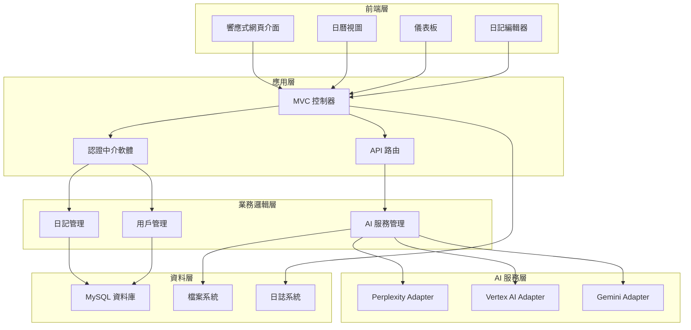
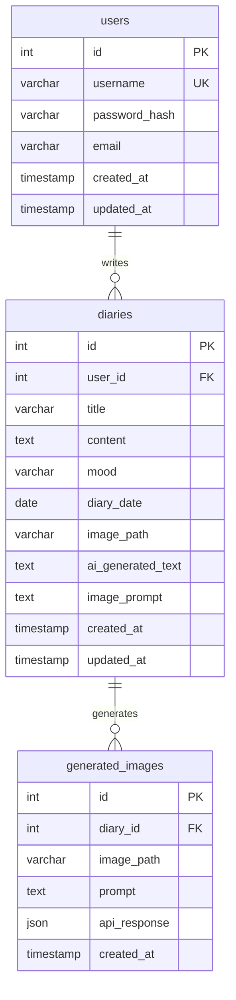

# 🎨 MoodCanvas - AI 情緒日記

> **讓每一天的感受，都成為藝術**

[](https://php.net)
[](https://mysql.com)
[](LICENSE)
[](CONTRIBUTING.md)

MoodCanvas 是一個創新的情緒日記應用程式，結合傳統日記寫作與現代 AI 技術，透過智慧圖像生成和情感分析，將您的文字轉化為視覺藝術，讓每一天的心情都能被生動地記錄和回味。

## ✨ 核心功能

### 📅 智慧心情日曆
- **視覺化心情追蹤** - 直觀瀏覽每日情緒變化
- **多日記支援** - 同一天可記錄多篇心情
- **心情統計** - 自動計算情緒分佈和趨勢

### 🖼️ AI 圖像生成
- **Vertex AI 驅動** - Google 最新的 Imagen 模型
- **多種藝術風格** - 吉卜力、寫實攝影、梵谷、康丁斯基等
- **智慧提示詞優化** - 自動分析日記內容生成精準圖片
- **情感氛圍映射** - 根據心情自動調整燈光和色調

### 💬 AI 心情短語
- **Perplexity AI 驅動** - 生成富有詩意的心情註解
- **多語言支援** - 智慧判斷輸出中文或英文
- **情境感知** - 根據日記內容生成貼切的短語

### 📊 情緒洞察儀表板
- **熱力圖分析** - 視覺化心情分佈
- **趨勢圖表** - 追蹤長期情緒變化
- **詞雲展示** - 分析常用詞彙和主題
- **AI 智慧洞察** - 專業心理分析與建議

### 🔒 安全與體驗
- **使用者認證系統** - 安全的註冊登入機制
- **響應式設計** - 完美適配手機、平板、桌面
- **日系簡約風格** - 文青高級的視覺設計
- **隱私保護** - 您的日記只屬於您

## 🚀 技術架構

### 後端技術棧
- **PHP 7.4+** - 現代化 MVC 架構
- **MySQL/MariaDB** - 可靠的資料儲存
- **自定義路由系統** - 靈活的 URL 處理
- **Adapter 設計模式** - 模組化 AI 服務整合

### 前端技術棧
- **HTML5 + CSS3** - 語義化標記與現代樣式
- **原生 JavaScript** - 輕量化互動體驗
- **Chart.js + D3.js** - 專業資料視覺化
- **響應式設計** - Mobile-First 開發理念

### AI 服務整合
- **Google Vertex AI** - 企業級圖像生成
- **Perplexity AI** - 智慧文字生成
- **Google Gemini** - 多模態 AI 支援
- **Stability AI** - 備用圖像服務

## 🏗️ 系統架構圖



## 📋 安裝指南

### 系統需求

- **PHP 7.4+** (建議 8.0+)
- **MySQL 5.7+** 或 **MariaDB 10.3+**
- **Apache 2.4+** 或 **Nginx 1.18+**
- **至少 512MB 記憶體**
- **1GB 可用硬碟空間**

### 快速安裝

#### 1. 下載專案
```bash
git clone https://github.com/your-username/MoodCanvas.git
cd MoodCanvas
```

#### 2. 環境配置
```bash
# 複製環境配置檔案
cp .env.example .env

# 編輯配置 (請參考下方詳細配置說明)
nano .env
```

#### 3. 資料庫設定
```bash
# 登入 MySQL
mysql -u root -p

# 創建資料庫
CREATE DATABASE mood_canvas_db CHARACTER SET utf8mb4 COLLATE utf8mb4_unicode_ci;

# 創建用戶 (可選)
CREATE USER 'moodcanvas'@'localhost' IDENTIFIED BY 'your_secure_password';
GRANT ALL PRIVILEGES ON mood_canvas_db.* TO 'moodcanvas'@'localhost';
FLUSH PRIVILEGES;

# 匯入資料庫結構
mysql -u moodcanvas -p mood_canvas_db < database/mood_canvas_schema.sql
```

#### 4. Web 伺服器配置

**Apache (.htaccess 已包含)**
```apache
# 確保 mod_rewrite 已啟用
sudo a2enmod rewrite
sudo systemctl restart apache2

# 虛擬主機範例
<VirtualHost *:80>
    DocumentRoot /path/to/MoodCanvas/public
    ServerName moodcanvas.local

    <Directory /path/to/MoodCanvas/public>
        AllowOverride All
        Require all granted
    </Directory>
</VirtualHost>
```

**Nginx**
```nginx
server {
    listen 80;
    server_name moodcanvas.local;
    root /path/to/MoodCanvas/public;
    index index.php;

    location / {
        try_files $uri $uri/ /index.php?$query_string;
    }

    location ~ \.php$ {
        fastcgi_pass unix:/var/run/php/php8.0-fpm.sock;
        fastcgi_index index.php;
        fastcgi_param SCRIPT_FILENAME $document_root$fastcgi_script_name;
        include fastcgi_params;
    }

    # 安全設定
    location ~ /\. {
        deny all;
    }

    location ~* \.(log|sql)$ {
        deny all;
    }
}
```

#### 5. 檔案權限設定
```bash
# 設定適當的檔案權限
chmod -R 755 .
chmod -R 777 public/storage/generated_images
chmod -R 777 logs
chmod 600 .env
chmod 600 config/gcp-service-account.json
```

## 🔧 AI 服務配置

### Perplexity AI (必須)
1. 前往 [Perplexity API](https://www.perplexity.ai/settings/api)
2. 創建帳戶並取得 API Key
3. 在 `.env` 中設定：
```bash
PERPLEXITY_API_KEY="pplx-your-api-key-here"
PERPLEXITY_MODEL="sonar"
```

### Google Vertex AI (推薦)
1. 前往 [Google Cloud Console](https://console.cloud.google.com)
2. 創建新專案或選擇現有專案
3. 啟用 Vertex AI API
4. 創建服務帳戶：
   - IAM & Admin → Service Accounts
   - 創建服務帳戶
   - 下載 JSON 金鑰檔案
   - 將檔案重命名為 `gcp-service-account.json` 並放入 `config/` 目錄
5. 在 `.env` 中設定：
```bash
GCP_PROJECT_ID="your-project-id"
GCP_REGION="us-central1"
```

### Google Gemini (選用)
1. 前往 [Google AI Studio](https://aistudio.google.com/app/apikey)
2. 取得 API Key
3. 在 `.env` 中設定：
```bash
GEMINI_API_KEY="your-gemini-api-key"
GEMINI_TEXT_MODEL="gemini-2.5-flash"
```

### Stability AI (選用)
1. 前往 [Stability AI](https://platform.stability.ai/account/keys)
2. 取得 API Key
3. 在 `.env` 中設定：
```bash
STABILITY_API_KEY="sk-your-stability-key"
STABILITY_MODEL="stable-diffusion-xl-1024-v1-0"
```

## 🎯 .env 完整配置範例

```bash
# === AI 服務配置 ===
PERPLEXITY_API_KEY="pplx-your-key-here"
PERPLEXITY_MODEL="sonar"

GCP_PROJECT_ID="your-gcp-project"
GCP_REGION="us-central1"

GEMINI_API_KEY="your-gemini-key"
GEMINI_TEXT_MODEL="gemini-2.5-flash"

# === 資料庫配置 ===
DB_HOST=localhost
DB_PORT=3306
DB_NAME=mood_canvas_db
DB_USER=moodcanvas
DB_PASS=your_secure_password

# === 應用程式配置 ===
DEBUG=false
APP_URL=https://your-domain.com

# === 安全設定 ===
SESSION_TIMEOUT=3600
ENABLE_SECURITY_CHECKS=true
RATE_LIMIT_ENABLED=true
```

## 📊 資料庫結構

### ERD 圖表


## 🐛 故障排除

### 常見問題

#### 1. AI 圖片生成失敗
**症狀**: 圖片生成返回錯誤或空白
**解決方案**:
- 檢查 Vertex AI 服務帳戶設定
- 確認專案 ID 和區域正確
- 檢查 API 配額和計費狀態

#### 2. 資料庫連線失敗
**症狀**: 無法載入頁面，顯示資料庫錯誤
**解決方案**:
- 檢查 `.env` 中的資料庫設定
- 確認 MySQL 服務正在運行
- 驗證用戶權限

#### 3. AI 文字生成失敗
**症狀**: 心情短語無法生成
**解決方案**:
- 檢查 Perplexity API Key
- 確認網路連線
- 檢查 API 配額

#### 4. 檔案上傳權限錯誤
**症狀**: 無法儲存生成的圖片
**解決方案**:
```bash
chmod -R 777 public/storage/generated_images
chown -R www-data:www-data public/storage
```

### 日誌檢查
```bash
# 檢查應用程式日誌
tail -f logs/app.log

# 檢查錯誤日誌
tail -f logs/error.log

# 檢查 Web 伺服器日誌
tail -f /var/log/apache2/error.log  # Apache
tail -f /var/log/nginx/error.log    # Nginx
```

## 🚀 部署到生產環境

### 安全檢查清單
- [ ] 設定 `DEBUG=false`
- [ ] 使用 HTTPS
- [ ] 設定強密碼
- [ ] 更新所有 API Keys
- [ ] 設定適當的檔案權限
- [ ] 啟用防火牆
- [ ] 設定定期備份

### 效能優化
- [ ] 啟用 OpCache
- [ ] 設定反向代理快取
- [ ] 壓縮靜態資源
- [ ] 設定 CDN (可選)

### 監控設定
- [ ] 設定日誌輪替
- [ ] 監控磁碟空間
- [ ] 設定 SSL 憑證自動更新
- [ ] 建立健康檢查端點

## 🤝 貢獻指南

我們歡迎任何形式的貢獻！

### 如何貢獻
1. Fork 此專案
2. 創建功能分支 (`git checkout -b feature/amazing-feature`)
3. 提交更改 (`git commit -m 'Add some amazing feature'`)
4. 推送到分支 (`git push origin feature/amazing-feature`)
5. 開啟 Pull Request

### 開發設定
```bash
# 啟用開發模式
DEBUG=true

# 安裝開發依賴
composer install --dev

# 運行測試 (如果有)
php tests/run-tests.php
```

## 📄 授權條款

此專案採用 MIT 授權條款 - 詳見 [LICENSE](LICENSE) 檔案

## 🎨 設計理念

MoodCanvas 的設計靈感來自於日本的 **物の哀れ** (mono no aware) 概念，強調對事物無常之美的感知。我們希望透過 AI 技術，幫助用戶更深刻地理解和表達自己的情感，將每一天的心情轉化為永恆的藝術作品。

## 🌟 致謝

- **Google Vertex AI** - 提供強大的圖像生成能力
- **Perplexity AI** - 提供智慧的文字生成服務
- **Chart.js & D3.js** - 優秀的資料視覺化工具
- **所有貢獻者** - 讓 MoodCanvas 變得更好

---

<div align="center">

**MoodCanvas** - *讓您的心情，成為藝術* 🎨✨

[🌐 官方網站](https://moodcanvas.com) • [📖 文檔](https://docs.moodcanvas.com) • [🐛 回報問題](https://github.com/your-username/MoodCanvas/issues) • [💬 討論區](https://github.com/your-username/MoodCanvas/discussions)

</div>
