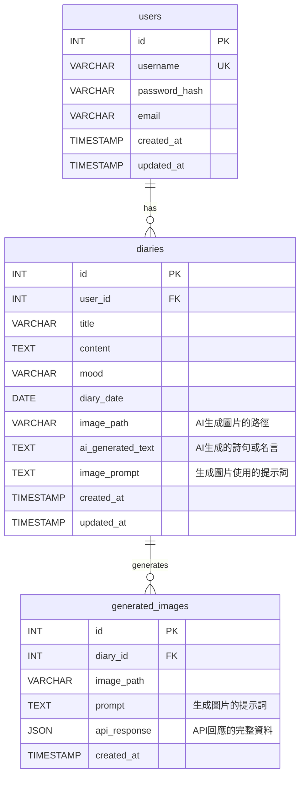

# MoodCanvas - AI 情緒日記

MoodCanvas 是一個創新的情緒日記應用程式，它結合了傳統日記寫作與現代人工智慧技術，旨在為使用者提供一個獨特且富有創意的記錄心情的方式。透過 AI 圖像生成和心情短語功能，MoodCanvas 將您的文字轉化為視覺藝術和富有洞察力的語句，讓每一天的感受都能被生動地捕捉和回味。

## ✨ 主要功能

*   **心情日曆**：直觀地瀏覽您的每日心情記錄。
*   **AI 圖像生成**：根據日記內容、您的心情和選定的藝術風格（如**優化後的吉卜力**、寫實攝影、梵谷等），自動生成獨特且更貼切的圖像。
*   **AI 心情短語**：為您的日記生成富有詩意或啟發性的短語。
*   **情緒洞察儀表板**：透過熱力圖、趨勢圖和詞雲，視覺化分析您的情緒模式。
*   **響應式設計 (RWD)**：在不同裝置上提供流暢的使用體驗。
*   **使用者認證**：安全的註冊、登入和登出功能。

## 🚀 技術棧

*   **後端**：PHP 7.4+ (MVC 架構)
*   **前端**：HTML5, CSS3 (**日系簡約文青高級風**), JavaScript
*   **資料庫**：MySQL / MariaDB
*   **AI 服務**：Perplexity AI (用於文字和圖像生成)
*   **圖表與視覺化**：Chart.js, D3.js, d3-cloud
*   **Web 伺服器**：Apache / Nginx (需配置 URL 重寫)

## 🏗️ 系統架構

MoodCanvas 採用了輕量級的 MVC (Model-View-Controller) 架構，確保了程式碼的模組化、可維護性和擴展性。AI 服務透過獨立的 Adapter 模式整合，便於未來替換或擴展不同的 AI 提供商。

```mermaid
graph TD
    A[使用者] -->|發送請求| B(瀏覽器)
    B -->|HTTP/HTTPS| C[Web 伺服器 (Apache/Nginx)]
    C -->|路由請求| D[前端控制器 (index.php)]

    D -->|調用| E[控制器 (Controller)]
    E -->|處理業務邏輯| F[模型 (Model)]
    F -->|資料操作| G[資料庫 (MySQL/MariaDB)]
    F -->|AI 請求| H[AI Adapter (PerplexityAdapter)]
    H -->|API 請求| I[外部 AI 服務 (Perplexity AI)]
    I -->|API 回應| H
    H -->|AI 結果| F
    F -->|資料返回| E
    E -->|準備資料| J[視圖 (View)]
    J -->|渲染 HTML/CSS/JS| B
    B -->|顯示介面| A

    subgraph AI 服務
        H
        I
    end

    subgraph 核心應用
        D
        E
        F
        J
    end

    subgraph 資料層
        G
    end
```

## 📊 資料庫 ERD

資料庫設計包含三個主要實體：`users` (使用者)、`diaries` (日記) 和 `generated_images` (AI 生成圖片記錄)。



## ⚙️ 安裝與設定

1.  **複製專案**：
    ```bash
    git clone https://github.com/your-username/MoodCanvas.git
    cd MoodCanvas
    ```

2.  **Web 伺服器設定**：
    *   配置您的 Apache 或 Nginx 伺服器，將文件根目錄指向 `public/` 資料夾。
    *   確保 URL 重寫 (mod_rewrite for Apache, 或 Nginx 的 try_files) 已啟用，以便 `index.php` 處理所有請求。

3.  **資料庫設定**：
    *   使用 MySQL 或 MariaDB 建立一個新的資料庫 (例如 `mood_canvas_db`)。
    *   匯入 `database/mood_canvas_schema.sql` 檔案來建立資料表結構和範例資料。

4.  **環境變數設定**：
    *   複製 `.env.example` 為 `.env`：
        ```bash
        cp .env.example .env
        ```
    *   編輯 `.env` 檔案，填寫您的資料庫連線資訊和 Perplexity AI API Key：
        ```ini
        DB_HOST=localhost
        DB_NAME=mood_canvas_db
        DB_USER=your_db_user
        DB_PASS=your_db_password
        
        APP_URL=http://localhost/MoodCanvas/public # 您的應用程式公開 URL
        
        PERPLEXITY_API_KEY=your_perplexity_api_key_here
        PERPLEXITY_MODEL=llama-3.1-sonar-large-128k-online # 或其他您偏好的模型
        ```

5.  **PHP 依賴**：
    *   由於這是一個輕量級專案，目前沒有 Composer 依賴。但如果未來有，請運行：
        ```bash
        composer install
        ```

## ▶️ 運行專案

完成上述設定後，透過您的 Web 伺服器訪問 `APP_URL` 中設定的位址 (例如 `http://localhost/MoodCanvas/public`) 即可運行應用程式。

## 🤝 貢獻

歡迎任何形式的貢獻！如果您有任何建議、錯誤報告或功能請求，請隨時提交 Issue 或 Pull Request。

## 📄 授權

此專案根據 MIT 授權條款發布。詳情請參閱 `LICENSE` 檔案 (如果存在)。

---

**MoodCanvas** - 讓您的心情，成為藝術。🎨✨
